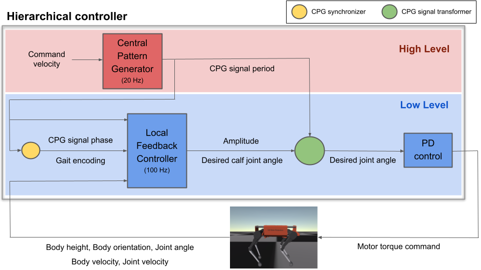
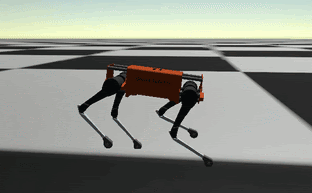
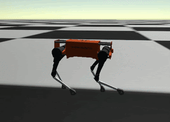
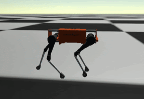
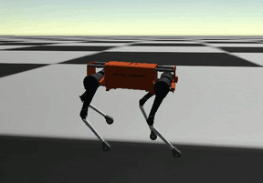

# Learning multiple gaits of quadruped robot using hierarchical reinforcement learning

We propose a method to learn multiple gaits of quadruped robot using hierarchical reinforcement learning. We designed a hierarchical controller and a learning framework that could learn and show multiple gaits in a single policy. Every experiment was done in RAISIM simulator [link](https://raisim.com/sections/Introduction.html).

Using our method, quadruped robot can learn multiple gaits including Trot, Pace, and Bound(imperfect). We further successfully learned multiple gait in a single policy using our framework. To show the existence of optimal gaits for specific velocity range, we held an analysis of mechanical energy usage for each learned gaits. Check the paper for detailed results.

- Paper: https://bit.ly/3rNwX7g
- Project slides: https://bit.ly/3ADOjV1

# Method
<div>
  
</div>

# Result
1. Trot

2. Pace

3. Bound (imperfect)

4. Multiple gaits in a single policy (Pace & Bound)


# Cite
```
@inproceedings{kim2021multiplegait,
    author = {Yunho Kim, Bukun Son, and Dongjun Lee},
    title = {Learning multiple gaits of quadruped robot using hierarchical reinforcement learning},
    booktitle={},
    year={2021}
}
```
